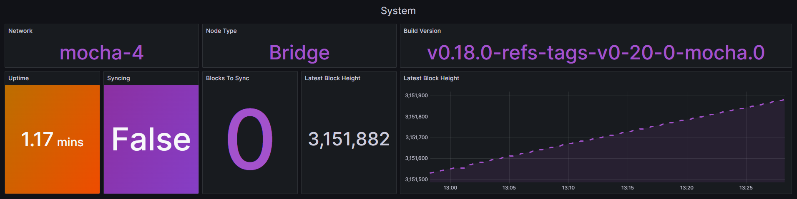

<p align="center">
  
</p>

# Celestia Bridge Node Monitoring stack

This project provides a monitoring solution for Celestia Bridge Node using Otel, Prometheus, Grafana, and Alertmanager. The stack enables real-time data visualization, monitoring, and alerting for your node's health and performance.

## Installation

Follow these steps to install the necessary dependencies and deploy the monitoring stack.

### 1. Install Docker

Install Docker, a containerization platform required for running the monitoring services:

```bash
sudo apt-get update
sudo apt-get -y install ca-certificates curl

sudo install -m 0755 -d /etc/apt/keyrings
sudo curl -fsSL https://download.docker.com/linux/ubuntu/gpg -o /etc/apt/keyrings/docker.asc
sudo chmod a+r /etc/apt/keyrings/docker.asc

echo "deb [arch=$(dpkg --print-architecture) signed-by=/etc/apt/keyrings/docker.asc] https://download.docker.com/linux/ubuntu $(. /etc/os-release && echo "$VERSION_CODENAME") stable" | sudo tee /etc/apt/sources.list.d/docker.list > /dev/null
sudo apt-get update

sudo apt-get -y install docker-ce docker-ce-cli containerd.io docker-buildx-plugin docker-compose-plugin

sudo systemctl enable docker.service containerd.service
sudo systemctl start docker.service containerd.service
```

### 2. Clone the Monitoring Stack Repository

Clone the repository that contains the monitoring stack configuration:

```bash
rm -rf $HOME/celestia-bridge-monitoring
git clone https://github.com/kjnodes/celestia-bridge-monitoring.git $HOME/celestia-bridge-monitoring
cd $HOME/celestia-bridge-monitoring
```

## Pre-Configuration

Before deploying the monitoring stack, configure Alerting and Otel settings.

### 1. Set Up Telegram Alerting

Configure Alertmanager to send notifications via Telegram. Update the `YOUR_TELEGRAM_BOT_TOKEN` and `YOUR_TELEGRAM_USER_ID` in the Alertmanager configuration file.

| KEY | VALUE |
|---------------|-------------|
| YOUR_TELEGRAM_USER_ID | Your Telegram user ID can be obtained from [@userinfobot](https://t.me/userinfobot). |
| YOUR_TELEGRAM_BOT_TOKEN | Get your bot token from [@botfather](https://telegram.me/botfather). Follow the steps outlined [here](https://core.telegram.org/bots#6-botfather) to create a new token. |

Edit the configuration file:

```bash
vim alertmanager/alertmanager.yml
```

Example configuration:

```yml
receivers:
  - name: 'telegram'
    telegram_configs:
      - send_resolved: true
        bot_token: '74064354354:AfeDFge7zdw-oJBOyf1CuEryo9gwpFfcw'
        chat_id: 442175262
        message: '{{ template "telegram.message" . }}'
```

### 2. Configure Otel

In order to send metrics to Celestia Foundation Otel Collector you have to update `OTEL_ENDPOINT` in the configuration file to point to either testnet or mainnet:

```bash
vim otel/otel-config.yaml
```

Example configuration:

```yml
exporters:
  otlphttp:
    endpoint: 'https://otel.celestia.observer'
  prometheus:
    endpoint: '0.0.0.0:8889'
    namespace: celestia
    send_timestamps: true
    metric_expiration: 180m
    enable_open_metrics: true
    resource_to_telemetry_conversion:
      enabled: true
```

## Monitoring stack deployment

```bash
docker compose up -d
```

## Configure Celestia bridge node

In order to start sending metrics to Otel Collector you have to add `--metrics`, `--metrics.endpoint` and `--metrics.tls` flags to bridge node execution.

Example configuration:

```bash
celestia bridge start --metrics --metrics.tls=false --metrics.endpoint=123.123.123.123:4318
```

## Data Visualization Using Grafana

Follow these steps to access and use the Celestia Bridge Node Dashboard in Grafana:

1. Open Grafana in your web browser (default port: 9999).

2. Log in using the default credentials `admin/admin`, then set a new password.

3. Navigate to the `Dashboards` page to access the `Celestia Bridge Dashboard`.

## Dashboard contents

The Grafana dashboard is organized into three main sections:

### 1. System

Shows system related metrics like build info, node sync status and service uptime.



### 2. Network

Displays peer connections.


### 3. Blockchain

Displays blockchain metrics, including block time, store put metrics, shrex responses and headers metrics.


## Alerting and Notifications

Alertmanager triggers alerts and sends notifications via Telegram when configured conditions are met, such as degraded block synchronization or low peers.

### Alerting Rules

| Alert Name             | Description                                         |
|------------------------|-----------------------------------------------------|
| TooFewPeers            | The number of connected peers is low.               |
| NoArchivalPeers        | Bridge node is not connected to any archival peers. |
| StalledBlocks          | Chain has stopped to produce blocks.                |
| NoReceiverMetricPoints | OTEL stopped to receive metrics from bridge node.   |
| InstanceDown           | Instance/service is down and not responding.        |
| OutOfSync              | Node is out of sync.                                |

You can find alert rules and conditions in [prometheus/alerts/alert.rules](prometheus/alerts/alert.rules)

Example of Telegram notification:

<div style="text-align: center;">
    
</div>

## Clean Up All Container Data

> **Warning:** This will remove all container monitoring stack data.

To stop and remove the monitoring stack and associated data, execute:

```
cd $HOME/celestia-bridge-monitoring
docker compose down --volumes
```

## Accessing the Monitoring Stack UI

You can access the monitoring tools using these ports:
- Prometheus: 9090
- Alertmanager: 9093
- Grafana: 9999
